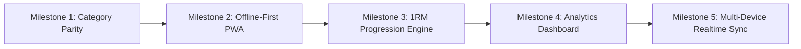

# GymLog Strategic Future Development Roadmap

This document outlines the high-level roadmap and architectural direction for future milestones in the GymLog ecosystem following the completion of the core React SPA migration (v4.2 / TASK-R101).

---

## 🧭 Milestone Overview

---

## 📌 Milestone Details & Feature Breakdown

### Milestone 1: Dynamic Category Sync & UI Standardization (v4.3)
* **Goal**: Full parity with legacy category creation across all views and modals.
* **Scope**:
  1. **Standardized Dropdown Selector**: Replace raw `<input>` elements in custom exercise creation (`CircuitCard.jsx`) with the standardized `<select>` dropdown populated from `uniqueCategories`.
  2. **Inline Creation Trigger**: Choosing `+ Add new...` triggers a clean prompt and creates the category across local state and backend Google Sheets.
  3. **Alphabetical Sorting**: Ensure all category lists display sorted alphabetically across Plan, Lift, Circuit, and Full Body views.
* **Target Cards**: `Story 1.4` / `TASK-R102`

---

### Milestone 2: Offline-First PWA & Gym Dead-Zone Resilience (v4.4)
* **Goal**: Guarantee zero latency and 100% functionality inside gym environments with poor cellular service.
* **Scope**:
  1. **Web App Manifest (`manifest.json`)**: Configures app icons, splash screens, theme colors, and standalone display mode for 1-tap installation on iOS and Android home screens.
  2. **Service Worker Asset Caching**: Pre-caches React production bundles (`index.html`, `index.css`, `index.js`, exercise image assets) via Vite PWA plugin.
  3. **Offline Set Buffering**: Ensure all logged sets, deletions, and day changes are automatically buffered in `localStorage` when offline and seamlessly flushed to Google Sheets once connection is restored.
* **Target Cards**: `EPIC-PWA` / `TASK-R103`

---

### Milestone 3: 1RM Progression Engine & Target Lock Polish (v4.5)
* **Goal**: Enhance the smart target calculator to guide progressive overload.
* **Scope**:
  1. **Standardized 1RM Calculation**: Apply proven formulas (Brzycki / Epley) to compute accurate estimated 1-Rep Maxes from logged sub-maximal sets.
  2. **Dynamic Target Highlighting**: The `useTargetLock` hook suggests optimal target weight ranges for upcoming workouts based on previous performance in that rep bracket.
  3. **Variation Linkage**: Map personal bests between Standard, Single, and Alternating variations to ensure consistent progressive overload tracking.
* **Target Cards**: `EPIC-TARGET-LOCK` / `TASK-R104`

---

### Milestone 4: Advanced Analytics Dashboard & Lifetime Progress (v4.6)
* **Goal**: Provide rich visual insights into workout consistency and strength progression over time.
* **Scope**:
  1. **Interactive Charts**: Render weekly workout frequency, muscle group volume distribution, and rep range breakdowns directly inside `SessionStatsModal.jsx`.
  2. **Personal Best Badges**: Celebrate all-time personal records (highest weight, most reps, longest duration) with visual badges and milestone indicators.
  3. **Export & Backup Tools**: One-click JSON / CSV export of complete workout history and settings directly from the Settings drawer.
* **Target Cards**: `EPIC-ANALYTICS` / `TASK-R105`

---

### Milestone 5: Multi-Device Real-Time Sync & WebSocket Bridge (Future Exploration)
* **Goal**: Real-time live synchronization between workout partners on separate devices at the same time.
* **Scope**:
  1. Lightweight WebSocket / Firebase / Supabase realtime bridge to broadcast logged sets instantly between partner phones during shared workouts.
  2. Live rest timer synchronization across devices.

---

## 🎯 Prioritization & Model Allocation

| Milestone | Complexity | Recommended AI Model Tier |
|---|---|---|
| **Milestone 1: Dynamic Category Sync** | Low-Medium | `MEDIUM_TIER` (Gemini 3.8 Flash / Claude Sonnet) |
| **Milestone 2: Offline-First PWA** | Medium | `MEDIUM_TIER` (Gemini 3.8 Flash / Gemini 3.1 Pro) |
| **Milestone 3: 1RM Progression Engine** | Medium-High | `HIGH_TIER` (Gemini 3.8 Pro / Claude Opus) |
| **Milestone 4: Analytics Dashboard** | Medium-High | `HIGH_TIER` (Gemini 3.8 Pro / Claude Opus) |
| **Milestone 5: Real-Time Sync Bridge** | High (Architecture) | `HIGH_TIER` (Gemini 3.8 Pro / Claude Opus) |
