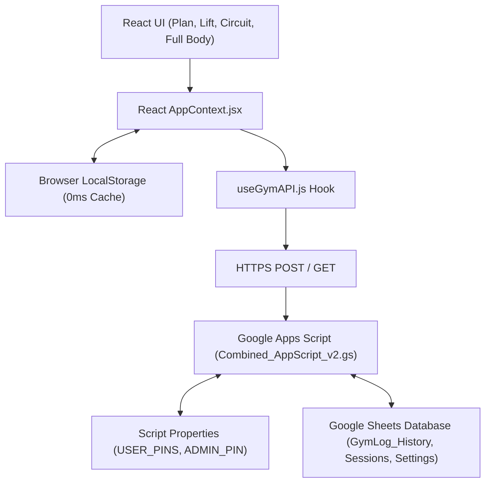

# Architecture Blueprint: GymLog React Single Page Application

## 1. Overview & Architecture Rationale
GymLog has been migrated from a legacy multi-file monolithic application (`gymlog-ultimate.html` and `circuit-training-pro.html`) to a high-performance **Vite + React 18 Single Page Application (SPA)** located in `/gymlog-react/`.

---

## 2. Core Technical Stack
* **Framework**: React 18 (Functional Components + Hooks)
* **Build Tooling**: Vite 8.x + ESBuild
* **State Management**: React Context (`AppContext.jsx`) + LocalStorage Caching
* **Styling**: Vanilla CSS Modules & CSS Custom Properties (`gym-core.css`, `index.css`)
* **Backend / Database**: Google Apps Script Webhook API (`Combined_AppScript_v2.gs` v4.2) backed by Google Sheets
* **CI/CD & Hosting**: GitHub Actions (`deploy.yml`) $\to$ GitHub Pages

---

## 3. Data Flow & Security Architecture



### Key Architectural Pillars:
1. **0ms Frictionless Local-First Execution**:
   - Set logging, deletions, and day counter adjustments occur instantly (0ms) in local state and `localStorage`.
   - Network sync to Google Sheets happens asynchronously in the background via atomic batch flushes.
2. **Dynamic Multi-User PIN Authentication & Guest Sandbox**:
   - Profiles are claimed using 4-digit PINs validated against Google Apps Script `USER_PINS`.
   - Guest Sandbox mode isolates all sets, timers, and progress strictly in `localStorage` with **0 network calls to Google Sheets**.
3. **Exact-Second Precision & Index-Safe Deletions**:
   - History entries store exact seconds (`M/d/yyyy, h:mm:ss a`) and set numbers (`setNum`), enabling conflict-free set deletions and atomic Google Sheet row removals.
4. **Single-Card Native Stepper & Modality Warm-Up**:
   - Workouts operate as a single-card stepper with Step 0 dedicated to pre-workout warm-up routines.

---

## 4. Component Hierarchy

```
gymlog-react/src/
├── App.jsx                       # Top-level view router and global container
├── main.jsx                      # React 18 root mount
├── context/
│   └── AppContext.jsx            # Single source of truth for global state, auth, and sync
├── hooks/
│   ├── useGymAPI.js              # HTTP client communicating with Google Apps Script
│   └── useTargetLock.js          # Dynamic 1RM & target rep range bracket calculator
├── components/
│   ├── Header.jsx                # Global navigation bar, live timer, and drawer triggers
│   ├── StickyRestBanner.jsx      # Hardware-accelerated sticky rest countdown timer
│   ├── PlanView.jsx              # Main daily split workout tracker (Push / Pull)
│   ├── LiftView.jsx              # Custom manual workout builder
│   ├── CircuitView.jsx           # High-intensity circuit trainer view
│   ├── FullBodyView.jsx          # Alternate full-body routine tracker
│   ├── ExerciseCard.jsx          # Decoupled exercise card with logging & history
│   ├── CircuitCard.jsx           # Specialized circuit exercise card with swap support
│   ├── WarmUpCard.jsx            # Pre-workout warm-up card (Step 0)
│   ├── WelcomeModal.jsx          # First-time device onboarding & PIN claim modal
│   ├── GuestUpgradeModal.jsx     # Workout completion modal for guest cloud upgrade
│   ├── SessionStatsModal.jsx     # Workout duration history & rep range analytics
│   ├── SettingsModal.jsx         # Global configuration, profile switcher, and Admin tools
│   └── ImageModal.jsx            # Exercise demonstration image viewer and uploader
└── utils/
    ├── locationHelper.js         # Gym equipment location matching utilities
    └── imageMapping.js           # Machine to image file lookup dictionary
```
